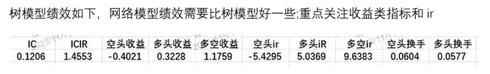
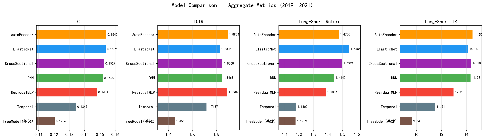
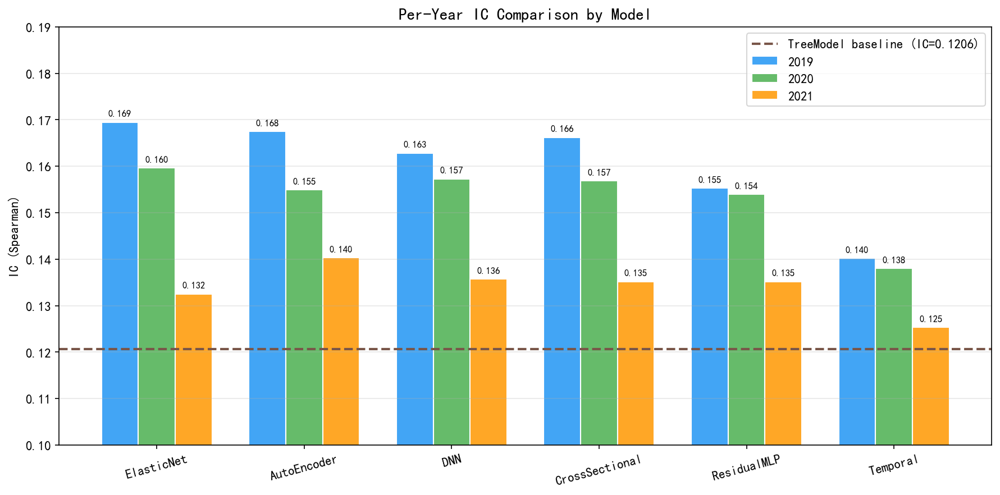
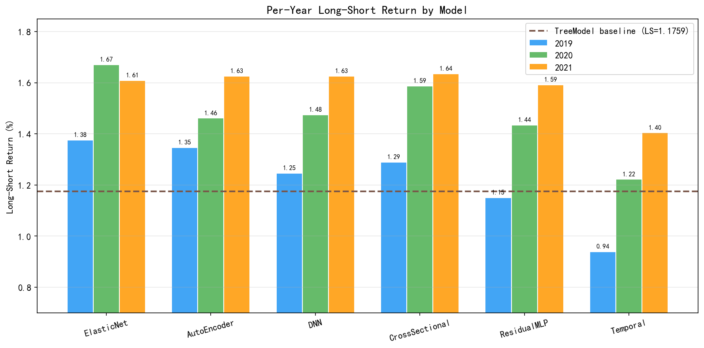

# 因子加权工作总结

> **项目目标：** 对 1128 个因子进行机器学习加权组合， 预测未来 10 日收益率

> **评估区间：** 2019–2021（每年独立 OOS 评估 + 全区间汇总）

**基线标准（树模型）：**


---

## 目录

1. [数据处理流程](#1-数据处理流程)
2. [模型总览](#2-模型总览)
3. [模型架构详细说明](#3-模型架构详细说明)
    - [3.1 ElasticNet](#31-elasticnet)
    - [3.2 MLP](#32-mlp)
    - [3.3 Residual MLP（残差网络）](#33-residual-mlp残差网络)
    - [3.4 Autoencoder](#34-autoencoder)
    - [3.5 Cross-Sectional Transformer（跨股票注意力机制）](#35-cross-sectional-transformer-跨股票注意力机制)
    - [3.6 Temporal Transformer（时序）](#36-temporal-transformer时序)
4. [训练设置](#4-训练设置)
    - [4.1 优化器与学习率调度](#41-优化器与学习率调度)
    - [4.2 正则化手段](#42-正则化手段)
5. [逐年分析](#5-逐年分析)
    - [5.1 逐年 IC](#51-逐年-ic)
    - [5.2 逐年多空收益（LS Return, %）](#52-逐年多空收益ls-return-)

---

## 1. 数据处理流程

### 1.1 数据来源

| 数据 | 文件格式 | 说明 |
|------|---------|------|
| **因子暴露** | `weakFactors.h5`（HDF5） | 每个快照下，按 key `/0`、`/1`、`/2` 存储 3 组因子（共 1128 个因子） |
| **标签** | `Label10.h5`（HDF5, PyTables TABLE） | 字段 `labelValue` 为未来 10 日前瞻收益率 |

### 1.2 快照与 IS/OOS 划分

各快照独立训练、独立评估，不跨快照合并数据。

| 快照名称 | 训练集截止 | OOS 评估区间 | OOS 年份 |
|----------|-----------|-------------|---------|
| `20181228` | 2018-12-28 | 2019-01-01 ~ 2019-12-31 | 2019 |
| `20191231` | 2019-12-31 | 2020-01-01 ~ 2020-12-31 | 2020 |
| `20201231` | 2020-12-31 | 2021-01-01 ~ 2021-12-31 | 2021 |

### 1.3 数据预处理步骤

```
原始 HDF5 文件
   │
   ├─ 读取 weakFactors.h5 (key /0, /1, /2)
   │   → DataFrame (日期×股票, 1128列因子)
   │
   ├─ 读取 Label10.h5
   │   → DataFrame (日期×股票, labelValue)
   │
   ├─ 日期+股票代码对齐 (inner join)
   │
   ├─ 去除含 NaN 的行
   │
   ├─ IS/OOS 分割 (按日期 ≤ cutoff / > cutoff)
   │
   ├─ IS 内部时序验证集分割 (后 15% 日期作为 val)
   │
   ├─ StandardScaler 标准化 (仅在 IS 训练集上 fit, transform 所有集合)
   │
   └─ 输出: X_train, y_train, X_val, y_val, X_oos, y_oos + 日期/股票索引
```

---

## 2. 模型总览

共实现 **6 个模型**（1 个线性基线 + 5 个深度学习模型），按 IC 降序排列：

| 排名 | 模型 | 类型 | IC | ICIR | 多空收益(%) | 多空 IR |
|:---:|------|------|:---:|:----:|:--------:|:------:|
| 🥇 | **AutoEncoder** | 编码器-预测器 | 0.1542 | 1.895 | 1.476 | 14.502 |
| 🥈 | **ElasticNet** | 线性回归 | 0.1539 | 1.830 | 1.548 | 14.135 |
| 🥉 | **Cross-Sectional** | 截面 Transformer | 0.1527 | 1.851 | 1.499 | 14.376 |
| 4 | **DNN (MLP)** | 前馈神经网络 | 0.1520 | 1.847 | 1.444 | 14.335 |
| 5 | **ResidualMLP** | 残差网络 | 0.1481 | 1.891 | 1.385 | 12.978 |
| 6 | **Temporal** | 时序 Transformer | 0.1345 | 1.719 | 1.180 | 11.510 |
| — | **基线** | 树模型 | 0.1206 | 1.455 | 1.176 | 9.638 |

### 具体结果

| 模型 | IC | ICIR | Short(%) | Long(%) | LS(%) | IR_LS | HS_Short | HS_Long |
|------|:---:|:----:|:-------:|:------:|:-----:|:-----:|:--------:|:-------:|
| **AutoEncoder** | **0.1542** | **1.895** | -0.457 | 0.376 | 1.476 | **14.502** | 0.061 | 0.058 |
| **ElasticNet** | 0.1539 | 1.830 | -0.470 | 0.385 | **1.548** | 14.135 | 0.060 | 0.057 |
| **CrossSectional** | 0.1527 | 1.851 | -0.457 | 0.389 | 1.499 | 14.376 | 0.061 | 0.060 |
| **DNN** | 0.1520 | 1.847 | -0.446 | 0.385 | 1.444 | 14.335 | 0.062 | 0.058 |
| **ResidualMLP** | 0.1481 | 1.891 | -0.449 | 0.343 | 1.385 | 12.978 | 0.061 | 0.063 |
| **Temporal** | 0.1345 | 1.719 | -0.393 | 0.345 | 1.180 | 11.510 | 0.055 | 0.054 |
| **基线** | 0.1206 | 1.455 | -0.402 | 0.323 | 1.176 | 9.638 | 0.060 | 0.058 |


#### 综合指标


四个维度的横向柱状图：IC、ICIR、多空收益、多空 IR，按 IC 排序。

#### 逐年 IC 对比



分组柱状图展示每个模型在 2019/2020/2021 三年的 IC 变化。

#### 逐年多空收益对比



分组柱状图展示每个模型在 2019/2020/2021 三年的多空收益变化。

---

## 3. 模型架构详细说明

### 3.1 ElasticNet

**类型：** 线性模型（scikit-learn）

**结构：**
```
输入 (1128 因子) → 线性组合 → 标量预测
```

**损失函数：**

$$\mathcal{L} = \frac{1}{2N}\|y - X\beta\|_2^2 + \alpha\left(\frac{1-\rho}{2}\|\beta\|_2^2 + \rho\|\beta\|_1\right)$$

- $\alpha = 0.01$（正则化强度），$\rho = 0.5$（L1/L2 平衡）
- L1 正则化带来稀疏性（~85%系数最终为 0），L2 正则化防止过拟合

---

### 3.2 MLP

**类型：** 多层感知机

**结构：**
```
输入 (F) → [Linear → BatchNorm → LeakyReLU → Dropout] × 4 → Linear(1)
隐藏层维度: 512 → 256 → 128 → 64 → 1
```

**损失函数：**

$$\mathcal{L} = \text{MSE}(\hat{y}, y) = \frac{1}{N}\sum_{i=1}^{N}(\hat{y}_i - y_i)^2$$

**优势：** 能够学习因子间非线性组合关系。Kaiming 初始化 + BatchNorm 保证训练稳定性。  

---

### 3.3 Residual MLP（残差网络）

**类型：** ResNet 风格的深度前馈网络

**结构：**
```
输入 (F) → Linear → BN → GELU → [ResidualBlock × 4] → Linear(1)

ResidualBlock:
    x → Linear → BN → GELU → Dropout → Linear → BN → (+x) → GELU
```

**优势：** 跳跃连接允许训练更深的网络，梯度流动更顺畅。  

---

### 3.4 Autoencoder

**类型：** 编码器 → 瓶颈层 → 预测器（附加重构损失）

**结构：**
```
输入 (F 因子) → Encoder [512 → 256] → 瓶颈层 (64 维)
                                         ├→ Predictor [128] → 标量预测
                                         └→ Decoder [256 → 512] → 重构输入 (F)
```

**损失函数：**

$$\mathcal{L} = \text{MSE}(\hat{y}, y) + \lambda_{\text{recon}} \cdot \text{MSE}(x, \hat{x})$$

- $\lambda_{\text{recon}} = 0.1$：重构损失权重


**优势：** 将 1128 个高度相关的因子压缩到 64 维潜在空间，降维同时保留有效信号；重构损失作为正则化手段，防止潜在空间只拟合预测相关的信息。  
**结果分析：** 在因子空间高度冗余（1128 个因子大量共线性）的场景下，降维 + 预测的双任务学习能有效过滤噪声、提取核心因子结构。

---

### 3.5 Cross-Sectional Transformer （跨股票注意力机制）


**结构：**
```
每个日期:
    [股票₁ 因子, 股票₂ 因子, …, 股票ₛ 因子]   (S, F)
        → stock_proj (F → d_model)
        → TransformerEncoder (跨股票注意力)
        → 每只股票 MLP head
        → 每只股票预测值                         (S,)
```

**优势：** 每只股票能看到同日期所有其他股票，学习截面结构（如行业、拥挤度）。  
**结果分析：** 截面注意力机制能捕捉股票间相对关系，这是纯逐样本（sample-wise）模型无法做到的。尤其在 2021 年表现最好（LS=1.636），说明市场结构信息在当年更加重要。

---

### 3.6 Temporal Transformer（时序）

**类型：** 因子历史序列的因果注意力

**结构：**
```
每只股票:
    [因子_{t-20}, 因子_{t-19}, …, 因子_t]   (W=20, F)
        → input_proj (F → d_model) + 正弦位置编码
        → Causal TransformerEncoder (带掩码: 不看未来)
        → 最后时间步表示
        → MLP head → 标量预测
```

**优势：** 能学习动量衰减、波动率聚集、市场状态切换等时序模式。  
**结果分析：** IC **最低**（0.1345），多空收益也最低（1.180%）。可能原因：  
1. 20 天窗口的因子值时序变化可能不足以产生强信号  
2. 因子本身是每日截面暴露值，时序上的自相关性可能较弱  
3. 模型参数量大，在有限样本下容易过拟合

---

## 4. 训练设置

### 4.1 优化器与学习率调度

所有深度学习模型使用 **AdamW** 优化器 + **SequentialLR** 学习率调度

### 4.2 正则化手段

金融收益预测的**信噪比极低**，激进的学习率会导致模型在前几轮就过拟合噪声。因此：

- **低学习率 + 预热** → 防止跳过微弱信号
- **强权重衰减** → 惩罚拟合噪声的大权重
- **小批量** → 每轮更多梯度更新，收敛更平滑
- **早停** → 泛化能力不再提升时立即停止


| 方法 | 说明 |
|------|------|
| **AdamW 权重衰减** | 解耦 L2 正则化 |
| **Dropout (0.3)** | 防止神经元共适应 |
| **梯度裁剪 (max_norm=1.0)** | 防止梯度爆炸 |
| **早停 + 最佳权重恢复** | 停止时恢复验证损失最低的权重 |
| **BatchNorm / LayerNorm** | 稳定训练，轻度正则化效果 |

---


## 5. 逐年分析

### 5.1 逐年 IC

| 模型 | 2019 | 2020 | 2021 | 趋势 |
|------|:----:|:----:|:----:|:----:|
| ElasticNet | **0.1695** | **0.1596** | 0.1325 | ↘ |
| AutoEncoder | 0.1675 | 0.1549 | **0.1403** | ↘ |
| CrossSectional | 0.1662 | 0.1568 | 0.1352 | ↘ |
| DNN | 0.1628 | 0.1573 | 0.1357 | ↘ |
| ResidualMLP | 0.1553 | 0.1540 | 0.1352 | ↘ |
| Temporal | 0.1402 | 0.1380 | 0.1253 | ↘ |

**观察：** 
- 所有模型的 IC 在 2019 → 2021 均呈下降趋势，符合 A 股市场 alpha 衰减的一般规律
- **AutoEncoder 在 2021 年 IC 降幅最小**（0.1675 → 0.1403，降幅 16%），展现了最强的抗衰减能力
- ElasticNet 在 2019 年 IC 最高，但在 2021 年衰减明显（降幅 22%）

### 5.2 逐年多空收益（LS Return, %）

| 模型 | 2019 | 2020 | 2021 | 趋势 |
|------|:----:|:----:|:----:|:----:|
| ElasticNet | 1.376 | **1.671** | 1.609 | → |
| AutoEncoder | 1.346 | 1.462 | 1.625 | ↗ |
| CrossSectional | 1.290 | 1.588 | **1.636** | ↗ |
| DNN | 1.246 | 1.475 | 1.626 | ↗ |
| ResidualMLP | 1.150 | 1.435 | 1.593 | ↗ |
| Temporal | 0.939 | 1.222 | 1.405 | ↗ |

**观察：**
- 多空收益呈上升趋势（与 IC 下降趋势相反），说明**因子收益分化在扩大**

---
